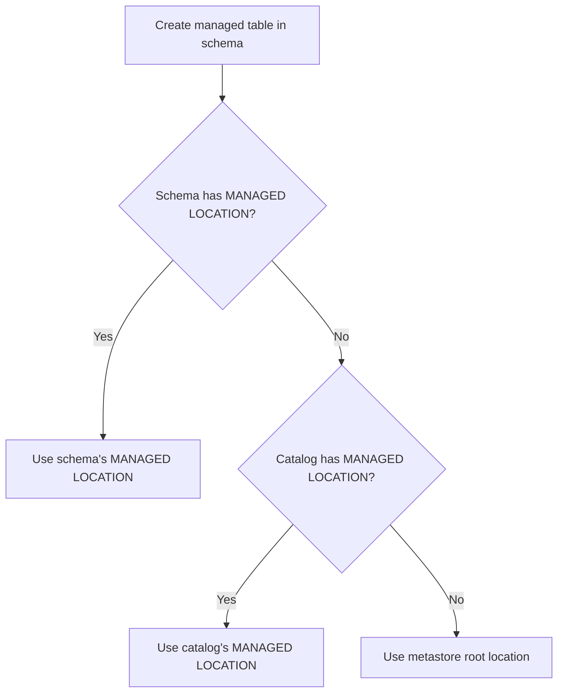

# Comprehensive Guide to Databricks Data Organization with Unity Catalog (3-Level Namespace)

This guide provides a deep technical walkthrough of **Unity Catalog (UC)** in Databricks, focusing on the **catalog.schema.table** hierarchy and the storage behavior of managed vs external objects. All examples assume **Azure ADLS Gen2** as primary storage (with S3 equivalents noted).

---

## 1. Core Concepts

### 1.1 Catalog, Schema, Table Hierarchy

Unity Catalog introduces a three‑level namespace that fully qualifies any data object:

```
catalog_name.schema_name.table_name
```

| Level   | Purpose                                                                 | Storage role                                                                 |
|---------|-------------------------------------------------------------------------|-------------------------------------------------------------------------------|
| **Catalog**   | Top‑level container for data assets. Typically maps to an environment (dev/test/prod) or a data domain (sales/finance). | Can define a **managed location** that serves as the default storage path for all managed tables inside the catalog (unless overridden). |
| **Schema**    | Also called *database*. Logical grouping of tables, views, and volumes. | Can define its own **managed location** that overrides the catalog’s managed location for tables within the schema. |
| **Table**     | Physical or logical representation of data (Delta, CSV, Parquet, etc.). | Has a **storage location** – either implicitly determined by the schema/catalog hierarchy (managed table) or explicitly provided by the user (external table). |

All three levels are registered in the Unity Catalog metastore, which handles governance, permissions, and lineage.

### 1.2 Managed vs External Storage

| Aspect               | Managed Table                                                                 | External Table                                                                |
|----------------------|-------------------------------------------------------------------------------|--------------------------------------------------------------------------------|
| **Storage control**  | Databricks Unity Catalog controls the full lifecycle – data files are stored under a **managed location** (catalog/schema/metastore root). | User provides an explicit **LOCATION** path (e.g., `abfss://...`). Databricks only reads/writes data; it does **not** manage the directory. |
| **DROP TABLE effect**| Deletes both metadata **and** the underlying data files.                      | Deletes only metadata. Data files remain at the external location.            |
| **Use case**         | Tables where Databricks should own the data lifecycle (e.g., temporary or ETL internal tables). | Tables that must share data with other systems or preserve data after table deletion. |

### 1.3 How Unity Catalog Controls Storage Locations

Unity Catalog uses a **hierarchical resolution** to determine the physical storage path for a managed table:

1. **Metastore root storage location** – defined when creating the Unity Catalog metastore (e.g., `abfss://metastore@account.dfs.core.windows.net/root`).
2. **Catalog managed location** – optional property on the catalog.
3. **Schema managed location** – optional property on the schema.
4. **Table‑level `LOCATION`** – only for external tables; for managed tables the path is automatically generated.

For **managed tables** (no explicit `LOCATION`), the final path is:
```
{managed_location_of_schema_or_catalog_or_metastore}/{catalog_name}/{schema_name}/{table_name}
```
If a schema has a managed location, it overrides the catalog’s; if the catalog has one, it overrides the metastore root.

> **Key insight**: Unity Catalog never stores two managed tables in the same user‑defined directory. The path is fully controlled by the hierarchy.

---

## 2. Catalog Creation Variants

A catalog is created using `CREATE CATALOG [IF NOT EXISTS] catalog_name [MANAGED LOCATION 'path']`. The presence or absence of `MANAGED LOCATION` determines where managed tables (without further overrides) will be stored.

### 2.1 Managed Catalog (Databricks‑managed storage)

**No `MANAGED LOCATION` specified.**  
Uses the **metastore root** location as the base for all managed tables inside the catalog.

```sql
CREATE CATALOG IF NOT EXISTS sales_catalog;
```

**Storage behavior**  
Assuming metastore root = `abfss://metastore@datalake.dfs.core.windows.net/unity/`, then a managed table `sales_catalog.default.orders` would be stored at:
```
abfss://metastore@datalake.dfs.core.windows.net/unity/sales_catalog/default/orders
```

**When to use**  
- Quick setup, no need to isolate storage per catalog.
- The metastore root is already on a customer‑owned account (most common).

### 2.2 Catalog with Explicit Managed Location

**Explicit `MANAGED LOCATION`** – overrides the metastore root for all managed tables in this catalog (unless overridden by a schema).

```sql
CREATE CATALOG IF NOT EXISTS analytics_catalog
MANAGED LOCATION 'abfss://analytics@datalake.dfs.core.windows.net/catalogs/analytics';
```

**Storage behavior**  
A managed table `analytics_catalog.finance.transactions` would be stored at:
```
abfss://analytics@datalake.dfs.core.windows.net/catalogs/analytics/finance/transactions
```

**When to use**  
- Separate storage accounts or containers for different catalogs (e.g., for cost allocation, regulatory requirements).
- You want the catalog’s data to reside in a specific cloud path that you control, while still benefiting from Unity Catalog’s managed table lifecycle.

### 2.3 “External Catalog” (Custom Storage Location)

> **Clarification**: In Unity Catalog, there is no separate “external catalog” type. A catalog always holds managed tables (unless you never create them) and external tables. The term “external catalog” is sometimes used informally for a catalog that **only contains external tables**, i.e., every table is created with `LOCATION`.  
> To satisfy the prompt, we show how to create a catalog that will be used **exclusively for external tables** (no managed location, and all tables point to existing cloud paths).

```sql
-- Create a catalog without a managed location
CREATE CATALOG IF NOT EXISTS external_data_catalog;

-- Create only external tables inside it
CREATE TABLE external_data_catalog.raw.clicks
USING delta
LOCATION 'abfss://raw@datalake.dfs.core.windows.net/clicks/';
```

**Storage behavior**  
The catalog itself has no storage authority; each table’s `LOCATION` fully determines where data resides. No data is stored under the metastore root.

**When to use**  
- You already have data in cloud storage and want to register it in Unity Catalog without moving or duplicating it.
- You need fine‑grained governance over existing data sets without giving Databricks ownership of the files.

### Summary Table – Catalog Creation

| Variant                                 | SQL Example                                                                 | Managed Table Storage Path                               | External Table Allowed? |
|-----------------------------------------|-----------------------------------------------------------------------------|----------------------------------------------------------|-------------------------|
| Managed catalog (no location)           | `CREATE CATALOG sales;`                                                     | `{metastore_root}/sales/{schema}/{table}`                | Yes                     |
| Catalog with managed location           | `CREATE CATALOG analytics MANAGED LOCATION 'abfss://.../analytics';`        | `abfss://.../analytics/{schema}/{table}`                 | Yes                     |
| Catalog for external tables only        | `CREATE CATALOG ext;` then always use `LOCATION` in table creation          | No managed tables created                                | Yes                     |

---

## 3. Schema (Database) Creation Variants

Schemas are created inside a catalog with `CREATE SCHEMA [IF NOT EXISTS] catalog_name.schema_name [MANAGED LOCATION 'path']`. They inherit from the catalog but can override.

### 3.1 Schema Without Location (Inherits from Catalog)

```sql
CREATE SCHEMA sales_catalog.retail;
```

**Storage inheritance**  
Managed tables in `sales_catalog.retail` will use the **catalog’s managed location** (or metastore root if catalog has none).

Example:
- Catalog `sales_catalog` has `MANAGED LOCATION 'abfss://sales@.../sales_catalog'`
- Then table `sales_catalog.retail.products` → `abfss://sales@.../sales_catalog/retail/products`

### 3.2 Schema with Explicit Managed Location

```sql
CREATE SCHEMA sales_catalog.europe
MANAGED LOCATION 'abfss://europe@datalake.dfs.core.windows.net/sales_europe';
```

**Override rule**  
This schema’s managed location **completely replaces** the catalog’s location for all managed tables inside it.

Table `sales_catalog.europe.orders` → `abfss://europe@.../sales_europe/orders`  
(Note: Unity Catalog does **not** append the catalog or schema name again; the `MANAGED LOCATION` is the exact base directory.)

### 3.3 External Schema (No Managed Tables)

A schema that will contain only external tables – simply create it without `MANAGED LOCATION` and never create managed tables.

```sql
CREATE SCHEMA external_data_catalog.landing;
-- Then create external tables with LOCATION
```

### Schema Storage Decision Flow



---

## 4. Table Creation Types

### 4.1 Managed Tables (No `LOCATION`)

**Managed Delta Table**
```sql
CREATE TABLE sales_catalog.retail.orders (
  order_id BIGINT,
  amount DECIMAL(10,2)
) USING delta;
```
Storage path is resolved via the hierarchy (schema → catalog → metastore root).  
The actual path becomes something like:  
`{resolved_base}/orders` (files inside a Delta directory).

**Managed Table from CTAS (Managed CTAS)**
```sql
CREATE TABLE sales_catalog.retail.high_value_orders
USING delta
AS SELECT * FROM sales_catalog.retail.orders WHERE amount > 1000;
```
Same storage resolution – no `LOCATION` means managed.

### 4.2 External Tables (With `LOCATION`)

**External Delta Table**
```sql
CREATE TABLE external_data_catalog.landing.clicks
USING delta
LOCATION 'abfss://landing@datalake.dfs.core.windows.net/clicks_data/';
```
- Databricks does **not** delete the `clicks_data/` directory when the table is dropped.
- The location can be any path for which the user has read/write permissions (via storage credentials).

**External CTAS**
```sql
CREATE TABLE external_data_catalog.analytics.enriched_clicks
USING delta
LOCATION 'abfss://analytics@datalake.dfs.core.windows.net/enriched/'
AS SELECT * FROM external_data_catalog.landing.clicks WHERE user_id IS NOT NULL;
```
Data is written directly to the user‑provided `LOCATION`.

### 4.3 Temporary Tables vs Global Temp Tables

| Feature               | Temporary View / Table                       | Global Temporary Table / View                          |
|-----------------------|----------------------------------------------|--------------------------------------------------------|
| **Scope**             | Session‑only (disappears after cluster restart or session end) | Visible across multiple queries in the same **SQL warehouse** or cluster session, but not persisted |
| **Namespace**         | No catalog/schema – resides in `local` schema | Resides in the `global_temp` schema (catalog `system`?) Actually: `global_temp` is a special schema inside the `system` catalog. |
| **Storage location**  | No physical storage – purely temporary       | No physical storage – purely temporary                 |
| **Example**           | `CREATE TEMP VIEW temp_high AS SELECT ... FROM sales_catalog.retail.orders;` | `CREATE GLOBAL TEMP VIEW global_high AS SELECT ... FROM sales_catalog.retail.orders;` then query `SELECT * FROM global_temp.global_high;` |
| **Use case**          | Short‑lived intermediate results within a notebook | Sharing temporary results across multiple SQL statements in a session |

> **Important**: Temporary objects are **never** stored in managed or external locations. They exist only in memory or local scratch.

---

## 5. Storage Resolution Logic (Critical Section)

This is the **core decision tree** that determines where the data files of a **managed table** (no `LOCATION` clause) are physically written.

### 5.1 Resolution Priority Order

1. **Table‑level `LOCATION`** – If provided, the table is **external**. Skip the rest.  
   → Storage = explicit `LOCATION`.

2. **Schema’s `MANAGED LOCATION`** – If the schema has this property, use it as the base directory.  
   → Storage = `{schema_managed_location}/{table_name}`

3. **Catalog’s `MANAGED LOCATION`** – If the catalog has this property, use it as the base.  
   → Storage = `{catalog_managed_location}/{schema_name}/{table_name}`

4. **Metastore root location** – Fallback.  
   → Storage = `{metastore_root}/{catalog_name}/{schema_name}/{table_name}`

### 5.2 Decision Tree (Managed Table)

```text
Does the table have a LOCATION clause?
│
├── YES → EXTERNAL TABLE → Use that exact LOCATION.
│
└── NO  → MANAGED TABLE → Is there a MANAGED LOCATION on the SCHEMA?
         │
         ├── YES → Use that as base directory → append table name.
         │
         └── NO  → Is there a MANAGED LOCATION on the CATALOG?
                  │
                  ├── YES → Use that as base → append schema name + table name.
                  │
                  └── NO  → Use METASTORE ROOT → append catalog/schema/table.
```

### 5.3 Examples

Assume:
- Metastore root = `abfss://root@storage.dfs.core.windows.net/unity`
- Catalog `c1` with `MANAGED LOCATION 'abfss://c1cont@storage.dfs.core.windows.net/c1'`
- Catalog `c2` with **no** managed location
- Schema `c1.s1` with **no** managed location
- Schema `c1.s2` with `MANAGED LOCATION 'abfss://s2cont@storage.dfs.core.windows.net/s2base'`

| Table Creation                                                       | Table Type  | Final Storage Path                                                                               |
|----------------------------------------------------------------------|-------------|--------------------------------------------------------------------------------------------------|
| `CREATE TABLE c1.s1.t1 ...` (no LOCATION)                            | Managed     | `abfss://c1cont@.../c1/s1/t1` (catalog location + schema + table)                               |
| `CREATE TABLE c1.s2.t2 ...` (no LOCATION)                            | Managed     | `abfss://s2cont@.../s2base/t2` (schema location overrides; table name appended directly)        |
| `CREATE TABLE c2.s3.t3 ...` (no LOCATION)                            | Managed     | `abfss://root@.../unity/c2/s3/t3` (metastore root + catalog + schema + table)                    |
| `CREATE TABLE c1.s1.ext_t4 LOCATION 'abfss://custom@.../path' ...`   | External    | `abfss://custom@.../path` (user‑provided)                                                        |

---

## 6. External Locations and Volumes

### 6.1 External Location

An **external location** is a Unity Catalog object that **registers** a cloud storage path (ADLS Gen2 or S3) along with a **storage credential**. It allows you to grant fine‑grained access (read/write/create) to that path without giving users direct cloud keys.

- **External location** = named reference to a storage path + a storage credential.
- **Storage credential** = authentication mechanism (Azure service principal, AWS IAM role) that UC uses to access the cloud storage.

**Create a storage credential (Azure example)**
```sql
CREATE STORAGE CREDENTIAL azure_cred
WITH (
  AZURE_SERVICE_PRINCIPAL = 'appId',
  AZURE_CLIENT_SECRET = 'secret',
  AZURE_TENANT_ID = 'tenantId'
);
```

**Create an external location**
```sql
CREATE EXTERNAL LOCATION raw_landing
URL 'abfss://landing@datalake.dfs.core.windows.net/raw/'
WITH (STORAGE CREDENTIAL azure_cred);
```

**Use the external location**  
When creating an external table, you can reference the external location’s URL, but you still need `LOCATION`. The external location itself does **not** become the table’s default location – it’s just a governed reference.

```sql
CREATE TABLE ext_catalog.raw.clicks
USING delta
LOCATION 'abfss://landing@datalake.dfs.core.windows.net/raw/clicks/';
-- The user must have USAGE on the external location 'raw_landing' to read/write there.
```

### 6.2 Volumes

A **volume** is a Unity Catalog object that provides **managed storage for non‑tabular data** (files, scripts, models, etc.). Unlike tables, volumes are **not** queried with SQL; they are accessed via file system commands (`/Volumes/catalog/schema/volume_name/`).

**Create a volume**  
Volumes must be created inside a schema. They always use **managed storage** – you cannot specify an external location for a volume (as of DBR 13+).

```sql
CREATE VOLUME sales_catalog.retail.scripts;
```

The physical path is determined by the same hierarchy as managed tables:
- If schema has `MANAGED LOCATION`: `{schema_managed_location}/scripts`
- Else if catalog has `MANAGED LOCATION`: `{catalog_managed_location}/retail/scripts`
- Else: `{metastore_root}/sales_catalog/retail/scripts`

**Access data in a volume** (Python/Spark)
```python
spark.read.format("text").load("/Volumes/sales_catalog/retail/scripts/log.txt")
```

### 6.3 Difference Between Volumes and Tables

| Feature         | Volume                                          | Table                                                |
|-----------------|-------------------------------------------------|------------------------------------------------------|
| **Data type**   | Any file (CSV, JSON, binary, scripts)          | Structured data (rows, columns) with schema         |
| **Access**      | File system paths (`/Volumes/...`)             | SQL queries (`SELECT * FROM table`)                 |
| **Storage**     | Always managed (cannot be external)            | Managed or external                                 |
| **Lifecycle**   | Dropping volume deletes all files              | Dropping managed table deletes data; external does not |

---

## 7. Real-World Architecture Mapping (Bronze/Silver/Gold)

A typical medallion architecture with Unity Catalog:

### 7.1 Example Setup

- **Storage account**: `datalake` (ADLS Gen2)
- **Metastore root**: `abfss://metastore@datalake.dfs.core.windows.net/unity`
- **Three catalogs** (one per environment or domain):
  - `bronze` – raw ingested data (managed location = `abfss://bronze@datalake.dfs.core.windows.net/data`)
  - `silver` – cleaned, validated data (managed location = `abfss://silver@datalake.dfs.core.windows.net/data`)
  - `gold` – aggregated, business‑ready data (managed location = `abfss://gold@datalake.dfs.core.windows.net/data`)

### 7.2 Creation Scripts

```sql
-- Bronze catalog
CREATE CATALOG bronze MANAGED LOCATION 'abfss://bronze@datalake.dfs.core.windows.net/data';
CREATE SCHEMA bronze.ingest;   -- inherits catalog location
CREATE SCHEMA bronze.raw;      -- inherits catalog location

-- Silver catalog
CREATE CATALOG silver MANAGED LOCATION 'abfss://silver@datalake.dfs.core.windows.net/data';
CREATE SCHEMA silver.cleansed;

-- Gold catalog
CREATE CATALOG gold MANAGED LOCATION 'abfss://gold@datalake.dfs.core.windows.net/data';
CREATE SCHEMA gold.aggregates;
```

### 7.3 Where Data Physically Resides

| Layer  | Table                                | Physical Path                                                                 |
|--------|--------------------------------------|--------------------------------------------------------------------------------|
| Bronze | `bronze.ingest.web_events` (managed) | `abfss://bronze@.../data/ingest/web_events`                                   |
| Silver | `silver.cleansed.events` (managed)   | `abfss://silver@.../data/cleansed/events`                                     |
| Gold   | `gold.aggregates.daily_stats` (managed) | `abfss://gold@.../data/aggregates/daily_stats`                                |
| (optional external) | `gold.reports.external_forecast` (external) | `abfss://shared@otheraccount.dfs.core.windows.net/forecast/` (external) |

### 7.4 Best Practices for Enterprise Setup

- **Separate catalogs per layer** – Clear storage isolation and independent permission management (e.g., only ETL pipelines can write to `bronze`, analysts read from `gold`).
- **Use schema for sub‑domains** inside a catalog (e.g., `bronze.finance`, `bronze.sales`).
- **Never mix managed and external tables in the same schema** if you want consistent lifecycle rules.
- **Set catalog‑level managed locations** to different storage containers or accounts – this enables cost tracking and performance isolation (e.g., bronze on cheaper, cooler storage).
- **Use external tables only when data must survive table deletion** or is produced by external systems (e.g., Kafka S3 sink).

---

## 8. Common Errors and Debugging

### 8.1 “External location does not exist”

**Error message** (simplified):
```
Path does not exist: abfss://nonexistent@storage.dfs.core.windows.net/path
```
**Cause**: The `LOCATION` path in an external table creation points to a bucket/container or folder that does **not** exist or the service principal lacks `List` permission.

**Solution**:  
- Pre‑create the path manually or ensure the storage credential has `Create` permission.  
- For managed tables, do **not** specify `LOCATION`.

### 8.2 Permission Issues (Storage Credential)

**Error**:
```
StorageCredentialNotFound or Access denied to storage location
```
**Cause**: The Unity Catalog metastore’s service principal (or the storage credential used in `EXTERNAL LOCATION`) does not have the required RBAC role (Azure: `Storage Blob Data Contributor`, AWS: `s3:PutObject` etc.).

**Solution**:  
- Assign the correct permissions on the storage account / bucket.  
- Verify the external location uses the right storage credential.

### 8.3 Wrong Path Usage – Mixing Managed and External

**Symptom**: A table was created as managed but you intended it to be external. Dropping the table accidentally deletes data.

**Debugging**:
```sql
DESCRIBE EXTENDED my_table;
-- Look at 'Location' property. If it starts with the metastore root or catalog managed location → managed.
-- If it points to an arbitrary cloud path → external.
```

**Prevention**: Always use `LOCATION` explicitly for external tables. Use naming convention: `ext_` prefix for external tables.

### 8.4 Confusion: “My external table is not appearing in the external location after DROP”

**Expected behavior**: Dropping an external table leaves the files untouched.  
If files disappear, the table was actually **managed** (no `LOCATION` was specified). Check `DESCRIBE EXTENDED`.

### 8.5 Schema / Catalog Override Not Applied

**Problem**: You set a schema’s `MANAGED LOCATION` but a managed table still uses the catalog’s location.

**Check**:  
- Did you alter the schema after creating tables? Existing tables do **not** move.  
- New tables will respect the new location.  
- Use `SHOW CREATE TABLE` to see the resolved location.

---

## 9. Best Practices

### 9.1 When to Use Managed vs External

| Scenario                                                              | Recommendation        |
|-----------------------------------------------------------------------|-----------------------|
| Tables that are part of an ETL pipeline and transient                | **Managed** – easy cleanup, no orphaned files. |
| Tables that must be shared with external engines (e.g., Spark on EMR) | **External** – data is accessible outside Databricks. |
| Regulatory requirement to store data in a specific, fixed directory  | **External** with explicit `LOCATION`. |
| Development / test tables that will be recreated frequently          | **Managed** – dropping them cleans up storage. |

### 9.2 Naming Conventions

- **Catalog**: lowercase, underscore separated, environment prefix (`prod_sales`, `dev_analytics`).
- **Schema**: domain or team name (`finance`, `marketing`).
- **Table**: descriptive, snake_case (`customer_transactions`).  
- **External table**: prefix `ext_` to avoid accidental drops (`ext_legacy_orders`).

### 9.3 Storage Governance Strategy

- **Define metastore root** on a dedicated container with lifecycle policies (e.g., delete temporary tables after 30 days).
- **Assign catalog‑level managed locations** to different containers or storage accounts for cost allocation and performance.
- **Use external locations** sparingly; prefer managed tables with catalog/schema managed locations for better governance.
- **Enable Unity Catalog lineage** to track where data flows.

### 9.4 Performance Considerations

- **Proximity**: Place the managed location in the same region as your compute.
- **Throughput**: For very high‑throughput workloads, use separate storage containers per catalog to avoid throttling.
- **Delta cache**: Managed and external tables both benefit from the Delta cache; the storage type does not affect caching.

---

## 10. Summary Table

| Object         | Managed? | Storage Control Level                       | Flexibility                                | Governance Strength | Data Deletion on DROP |
|----------------|----------|---------------------------------------------|--------------------------------------------|---------------------|-----------------------|
| **Catalog**    | N/A      | Optional `MANAGED LOCATION` (affects child schemas/tables) | You can set or omit; can be changed later (new tables only) | High – central location for permissions | N/A (catalog DROP fails if non‑empty) |
| **Schema**     | N/A      | Optional `MANAGED LOCATION` (overrides catalog) | Can override catalog; can be changed later | High – inherits catalog + own permissions | Schema DROP fails if non‑empty |
| **Table (Managed)** | Yes | Resolved hierarchy (schema → catalog → metastore root) | No user control over exact path | Very high – UC manages full lifecycle | Data + metadata deleted |
| **Table (External)** | No  | User‑provided `LOCATION` (any cloud path) | Full control over path; can reuse existing data | Medium – UC only tracks location, does not manage files | Only metadata deleted |

**Key takeaway**:  
- **Managed** = Databricks Unity Catalog decides the path and deletes data when the table is dropped.  
- **External** = You decide the path, data survives table deletion.  
- **Catalog and schema managed locations** give you hierarchical control to override storage without changing table definitions.

---

*This guide assumes Unity Catalog is enabled and you have the necessary privileges (`CREATE CATALOG`, `CREATE SCHEMA`, `CREATE TABLE`, `CREATE EXTERNAL LOCATION`, etc.). For S3, replace `abfss://container@account.dfs.core.windows.net/...` with `s3://bucket/...` and use AWS IAM roles for storage credentials.*