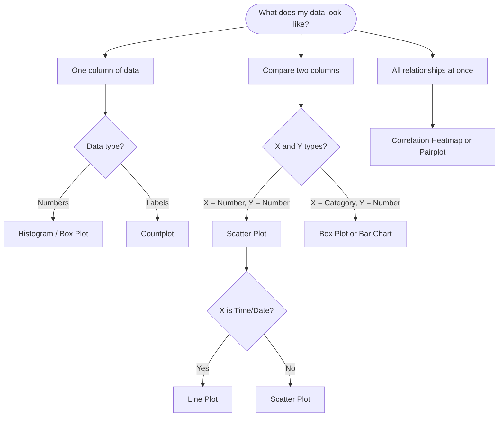

# Data Science Visualization
### *A Guide to Choosing the Right Plot Based on Variable Type*

---

## The Golden Rule of Data Visualization

> **Before you write a single line of plotting code, ask yourself two questions:**
> 1. What **type** are my variables? (Number, Category, Date, Text)
> 2. What **question** am I trying to answer? (Distribution? Relationship? Comparison?)

---

##  Section 1: Univariate Analysis (Exploring ONE Variable)

*Use these plots when you want to understand the shape, spread, or frequency of a single column.*

| **Plot Name**             | **Variable Type**      | **What It Teaches Us**                                                                                                                                  | **Visual Cue**                            |
| :------------------------ | :--------------------- | :------------------------------------------------------------------------------------------------------------------------------------------------------ | :---------------------------------------- |
| **Histogram**             | Numerical (Continuous) | **Shape of Data:** Is it normally distributed? Are there skews or gaps? *Essential for checking model assumptions.*                                     | Bars touching; counts on Y-axis           |
| **Density Plot**          | Numerical (Continuous) | **Smooth Distribution:** A "smoothed" histogram. Better for overlaying multiple groups to compare shapes.                                               | Smooth curve; probability on Y-axis       |
| **Box Plot**              | Numerical              | **Outliers & Spread:** Quickly identify the median, the middle 50% of data (IQR), and extreme values. *Your first line of defense against data errors.* | Box with whiskers; dots for outliers      |
| **Bar Chart (Countplot)** | Categorical            | **Category Frequency:** How many records belong to "Region A" vs. "Region B"?                                                                           | Bars separated by space; counts on Y-axis |

---

##  Section 2: Bivariate & Multivariate Analysis (Relationships)

*This is where data science happens. We are looking for predictors, patterns, and correlations.*

### **Scenario A: Numeric vs. Numeric**

| **Plot Name**    | **Purpose / Insight**                                                                                                                                 | **Teaching Point**                                                                              |
| :--------------- | :---------------------------------------------------------------------------------------------------------------------------------------------------- | :---------------------------------------------------------------------------------------------- |
| **Scatter Plot** | **Correlation & Clusters:** Does X increase when Y increases? Are there natural groupings?                                                            | **Advanced Tip:** Add `hue='Category'` to see a 3rd dimension. Add `size='Value'` to see a 4th. |
| **Line Plot**    | **Trend Over Sequence:** How does a metric change over **time** (Time Series) or over an ordered interval (e.g., training epochs)?                    | **Important:** Connect the dots **only** if X is ordered (Date, Step #).                        |
| **Heatmap**      | **Strength of Relationship:** Visual representation of a **Correlation Matrix**. Dark red = Strong positive link (potential multicollinearity issue). | Also used for **Confusion Matrices** in Model Evaluation.                                       |

### **Scenario B: Categorical vs. Numeric**

| **Plot Name**              | **Purpose / Insight**                                                                                                                             | **Teaching Point**                                        |
| :------------------------- | :------------------------------------------------------------------------------------------------------------------------------------------------ | :-------------------------------------------------------- |
| **Bar Chart (Aggregated)** | **Compare Averages/Totals:** Which product category has the **highest mean** sales?                                                               | **Code Note:** Requires `.groupby()` and `.mean()` first. |
| **Box Plot**               | **Compare Distributions:** Not just the average, but how **consistent** is the data in each group? Does Group A have wider variance than Group B? | **Better than Bar Chart** when data has outliers.         |
| **Violin Plot**            | **Advanced Distribution Shape:** Shows if a category has a **bimodal** (two-hump) distribution. A Box Plot hides this; a Violin Plot reveals it.  | Use for **High-Density EDA**.                             |

### **Scenario C: Categorical vs. Categorical**

| **Plot Name**         | **Purpose / Insight**                                                                                                              |
| :-------------------- | :--------------------------------------------------------------------------------------------------------------------------------- |
| **Stacked Bar Chart** | **Part-to-Whole Relationships:** How does the **proportion** of "Churned" vs. "Retained" customers differ between Payment Methods? |
| **Cross-Tab Heatmap** | **Frequency Matrix:** Visualizing the count of passengers in each "Class" vs. "Survival Status" (Titanic Dataset).                 |

---

##  Section 3: Specialized Data Types

| **Data Type**            | **Recommended Plot**             | **Use Case**                                                                                                                         |
| :----------------------- | :------------------------------- | :----------------------------------------------------------------------------------------------------------------------------------- |
| **Geospatial (Lat/Lon)** | **Choropleth Map / Scatter Map** | Regional analysis (Election results by county, Store locations).                                                                     |
| **Text / NLP**           | **Word Cloud**                   | Visualizing most frequent terms in customer reviews.                                                                                 |
| **Multi-Variable Grid**  | **Pairplot / `sns.pairplot()`**  | **The "First Look" Plot.** Plots every numeric column against every other numeric column in a single image. *Always run this first.* |

---

##  The Data Scientist's Decision Tree (Flow Chart)

*Use this flowchart to instantly know which plot to code next.*

---
